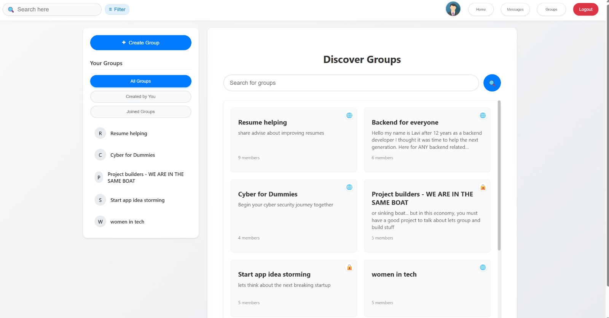
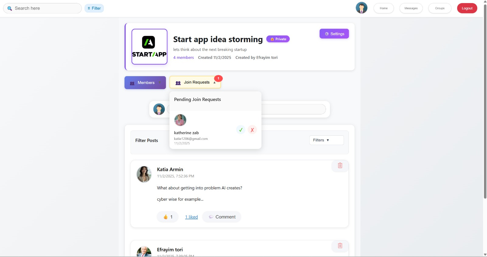
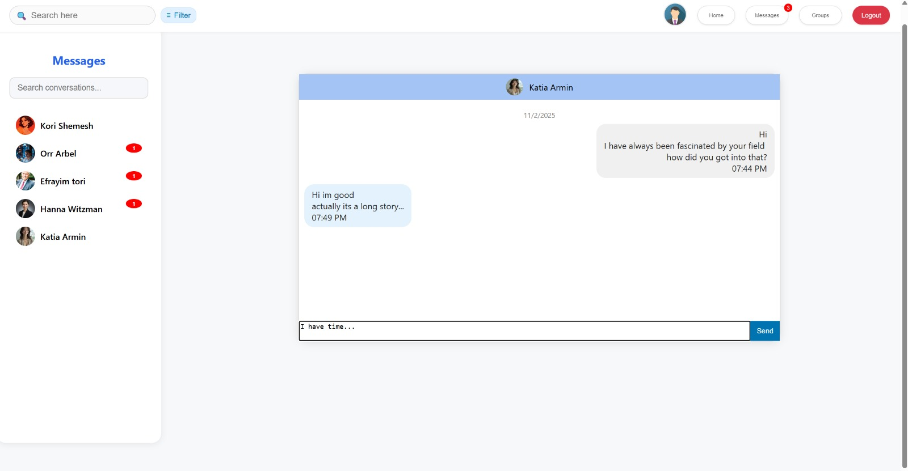

# Hireable

A social media platform designed for junior job seekers to connect, collaborate, and support each other. Hireable enables users to find project partners, seek advice from experienced seniors on the platform, and build a professional network.

## 🎯 Objective

The primary goal of Hireable is to create a supportive community where junior job seekers can:
- Connect with peers and experienced professionals
- Find project partners for collaboration
- Receive mentorship and advice from senior developers
- Build their professional network through groups and messaging

## ✨ Features

- **Home Feed**: View all posts from friends and the community
- **Groups**: Create, join, and manage groups for specific interests or projects
- **Messaging**: Real-time chat with other users using Socket.io
- **User Profiles**: Customizable profiles with posts, followers, and about sections
- **Posts & Comments**: Share content, media, and interact with posts through comments
- **Daily Questions**: Engage with daily questions to foster community interaction
- **Search & Discovery**: Find groups and users through search functionality
- **Group Management**: Create public or private groups, manage members, and handle join requests

## 🛠️ Tech Stack

### Frontend
- **React** - UI library
- **React Router** - Client-side routing
- **Socket.io Client** - Real-time messaging
- **Axios** - HTTP client
- **CSS Modules** - Component styling

### Backend
- **Node.js** - Runtime environment
- **Express** - Web framework
- **MongoDB** with **Mongoose** - Database
- **Socket.io** - Real-time communication
- **Cloudinary** - Image and media storage
- **bcryptjs** - Password hashing
- **Multer** - File upload handling

## 📸 A grasp from the app

<p align="center">
  <br>
  <em>🏠 <b>Home Feed</b> – browse posts, interact with the community, and view daily questions</em>
    

</p>

<p align="center">
  <br>
  <em>👥 <b>Groups Page</b> – discover, join, and create groups by interest or profession</em>
    

</p>

<p align="center">
  <br>
  <em>🛡️ <b>Group Admin View</b> – approve or reject join requests directly as a group administrator</em>
    

</p>

<p align="center">
  <br>
  <em>💬 <b>Messages Page</b> – real-time private chat between users powered by Socket.io</em>
    

</p>

<p align="center">
  <br>
  <em>🙋‍♀️ <b>User Profile</b> – personal page with posts, followers, and connections</em>
    

</p>

<p align="center">
  <br>
  <em>⚙️ <b>Profile Settings</b> – update user details, upload images, and manage privacy</em>
    

</p>


## 📋 Prerequisites

Before you begin, ensure you have the following installed:
- Node.js (v14 or higher)
- npm or yarn
- MongoDB database (local or cloud instance)
- Cloudinary account (for image uploads)

## 🚀 Installation & Setup

### 1. Clone the repository
```bash
git clone <your-repo-url>
cd projFile
```

### 2. Backend Setup

Navigate to the backend directory:
```bash
cd Final-react-project-Back
```

Install dependencies:
```bash
npm install
```

Create a `.env` file in the `Final-react-project-Back` directory with the following variables:
```env
PORT=5000
MONGODB_URI=your_mongodb_connection_string
CLOUDINARY_CLOUD_NAME=your_cloudinary_cloud_name
CLOUDINARY_API_KEY=your_cloudinary_api_key
CLOUDINARY_API_SECRET=your_cloudinary_api_secret
```

**Note**: Update the MongoDB connection string in `config/db.js` or use the `MONGODB_URI` environment variable.

### 3. Frontend Setup

Open a new terminal and navigate to the frontend directory:
```bash
cd Final-react-project
```

Install dependencies:
```bash
npm install
```

Update the Socket.io connection URL in `src/socketConnection.js` if your backend runs on a different port.

### 4. Run the Application

**Start the Backend Server:**
```bash
cd Final-react-project-Back
npm start
```
The backend server will run on `http://localhost:5000`

**Start the Frontend Development Server:**
```bash
cd Final-react-project
npm start
```
The frontend will run on `http://localhost:3000` and open automatically in your browser.

## 📁 Project Structure

```
projFile/
├── Final-react-project/          # React Frontend
│   ├── public/                   # Static files
│   ├── src/
│   │   ├── components/           # React components
│   │   │   ├── GroupsPage/       # Groups functionality
│   │   │   ├── Home/             # Home feed and posts
│   │   │   ├── HeaderBar/        # Navigation bar
│   │   │   ├── messages/         # Messaging components
│   │   │   └── profile/          # User profile components
│   │   ├── App.js               # Main app component
│   │   └── socketConnection.js  # Socket.io client setup
│   └── package.json
│
└── Final-react-project-Back/     # Node.js Backend
    ├── config/                   # Configuration files
    │   ├── db.js                # MongoDB connection
    │   ├── cloudinary.js        # Cloudinary setup
    │   └── socketConfig.js      # Socket.io server setup
    ├── controllers/             # Route controllers
    ├── models/                  # Mongoose models
    ├── routes/                  # Express routes
    ├── app.js                   # Main server file
    └── package.json
```

## 🔑 Environment Variables

### Backend (.env)
- `PORT` - Server port (default: 5000)
- `MONGODB_URI` - MongoDB connection string
- `CLOUDINARY_CLOUD_NAME` - Your Cloudinary cloud name
- `CLOUDINARY_API_KEY` - Your Cloudinary API key
- `CLOUDINARY_API_SECRET` - Your Cloudinary API secret

## 📸 Screenshots

_(Add your screenshots here to showcase the application features)_

## 🔌 API Endpoints

The backend provides the following main API routes:
- `/api/auth` - Authentication routes
- `/api/userinfo` - User information
- `/api/groups` - Group management
- `/api/messages` - Messaging
- `/api/quiz` - Daily questions/quiz
- `/api/filter-options` - Filter options
- `/api/upload` - File uploads
- `/api` - Profile photo uploads

## 🤝 Contributing

Contributions are welcome! Please feel free to submit a Pull Request.

## 📝 License

This project is open source and available for use.

## 🙏 Acknowledgments

Built with ❤️ for junior job seekers to connect, learn, and grow together.

